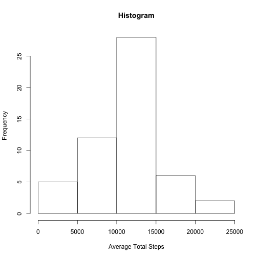
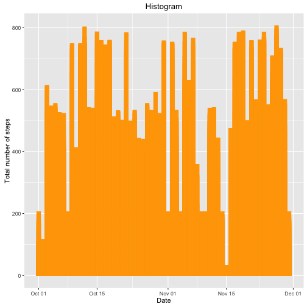
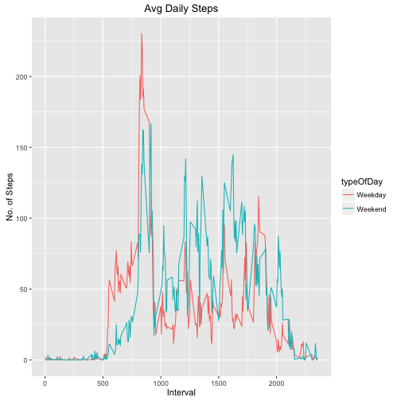

# Installing packages
First, installing the packages/libraries necessary to carry out the program. Also getting/setting the working directory in case it is necessary
```
library(ggplot2)
library(magrittr)
library(dplyr)
library(knitr)
getwd()
setwd("~/Coursera/ReproducibleResearch")
```
## Reading CSV file & omitting null rows
```
data <- read.csv("activity.csv")
df <- data.frame(data)
df <- na.omit(df)
```
## Question one asks: What is mean total number of steps taken per day?

Calculating the total number of steps taken per day
```
avgTotalSteps <- aggregate(df$steps, by = list(df$date), FUN = sum)
colnames(avgTotalSteps) <- c("Date","Total")
```
Make a histogram of the total number of steps taken each day



Calculate and report the mean and median of the total number of steps taken per day

Mean

```
## [1] 10766.19
```
Median

```
## [1] 10765
```
## What is the average daily activity pattern?
```
avgStepsPerInterval <- aggregate(df$steps, by = list(df$interval), FUN = sum)
colnames(avgStepsPerInterval) <- c("Interval", "Average")
plot(avgStepsPerInterval$Interval, avgStepsPerInterval$Average,
     axes = F, type = "l", col = "orange", xlab = "Time", 
     ylab = "Average Number of Steps", main = "Average Daily Activity")
axis(1, at = c(0, 600, 1200, 1800, 2400), label = c("12:00 AM","6:00 AM","12:00 PM","6:00 PM","12:00 AM"))
axis(2)

avgStepsPerInterval[which.max(avgStepsPerInterval$Average),]
```
## Strategy for filling in all missing values in dataset

```r
data <- read.csv("activity.csv")
df <- data.frame(data)
df <- na.omit(df)
avgSteps <- aggregate(df$steps, list(interval = as.numeric(as.character(df$interval))), FUN = "mean")
imputed <- data 
for (i in 1:nrow(imputed)) {
  if (is.na(imputed$steps[i])) {
    imputed$steps[i] <- avgSteps[which(imputed$interval[i] == avgSteps$interval), ]$x
  }
}
imputed$date <- as.Date(imputed$date)
```

Mean


Mean

```
## [1] 10766.19
```

Median

```
## [1] 10766.19
```
## Are there differences in activity patterns between weekdays and weekends?

```
## 
## Attaching package: 'dplyr'
```

```
## The following objects are masked from 'package:stats':
## 
##     filter, lag
```

```
## The following objects are masked from 'package:base':
## 
##     intersect, setdiff, setequal, union
```

```
##       steps       date interval typeOfDay
## 1 1.7169811 2012-10-01        0   Weekday
## 2 0.3396226 2012-10-01        5   Weekday
## 3 0.1320755 2012-10-01       10   Weekday
## 4 0.1509434 2012-10-01       15   Weekday
## 5 0.0754717 2012-10-01       20   Weekday
## 6 2.0943396 2012-10-01       25   Weekday
```


